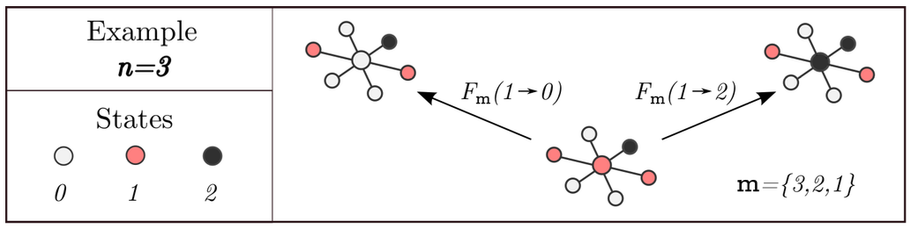

# Multistate Dynamical Processes On Networks
Is a pure Python package for simulating and calculating multistate dynamical process on networks. This work is based on 
a paper written by Peter G. Fennell and James P. Gleeson [1] where they introduced generalized approximation frameworks 
for the study and analysis of multistate dynamical processes on networks. They presented three degree-based frameworks, 
which allows to analyse the effects of network connectivity structures on dynamical processes. This work stands on
fundamentals of stochastic processes [2] and network theory [3].

## Structure
In this work we offer both empirical and analytical parts, therefore, we splitted the work into 4 fundamental objects:  

### `MultistateProcess` object
A continuous-time multistate dynamical processes is uniquely described by collection of the rate functions 
), where it denotes the rate at which a node in state 
!](https://latex.codecogs.com/svg.latex?i) changes to state  as a function of 
the the number of node's neighbors in each of  states 
.  An object `MultistateProcess` calculate transition rate matrix and 
transition probability matrix given the general rates and neighbor's states . 



#### Notation
Over the whole project we tried to use the same notation that is used in the original paper [1].

  
 : number of different states in the dynamical process  
 
 : vector where  is number of node's neighbors in each of n states, ()  
 ) 
 : the rate at which a node in state  changes to state , given the   
  
 : number of nodes in the network  
  
 : degree (, , min and max degrees)  
  
 : average degree in the network  
  
 : degree distribution (probability of k-degree node occurrence)  
  
 : all possible  where   

### `SimulateProcess` object
An object that simulates the dynamical process, knowing the network, the transition matrix and states from the previous 
iteration.

### `CalculateProcess` object
A generic object for calculating multistate dynamical process which is then inherited by one of the generalized 
approximation framework.

#### `MeanField` framework
Mean Field is the most relaxed, therefore, the most rough estimate of the dynamical process within the three
approximation frameworks. Where we assume that the states of each node in the network are independent. In the Mean Field
approximation we consider following relations:

 - expected fraction of nodes in state  of degree  at time   
 )  
 - probability that the neighbor of a node is in state  at time    
 =\sum_{k=0}^{\infty}\frac{kp_k}{<k>}x^j_k(t))
 

 - probability that a k-degree node has -neighbor in various states at time   
 =\frac{k!}{m_0!...m_{n-1}!}(\omega^0(t))^{m_0}...(\omega^{n-1}(t))^{m_{n-1}})

The Mean Field evolution equation for ) is:

F_m(i{\rightarrow}j))
F_m(j{\rightarrow}i))


Or having the matrix notation:

Mult(m)\mathbf{x}^k)


For more detailed description on Mean Field approximation see [jupyter nootebook](./notebooks/mean_field.ipynb), or 
follow he pages 10 and 11 in the original paper [1]. 

#### `PairApproximation` framework
TODO / not yet implemented.

#### `ApproximateMasterEquation` framework
TODO / not yet implemented.

### `Network` object
The `Network` object is outsourced from [matejker / network](https://github.com/matejker/network).

## Installation 
The package was developed on Python 3.6.9 and the required packages can be find in [requirements](./requirements)
folder. To install the package from this GitHub repo using `pip`:
```
pip install git+https://github.com/matejker/MultistateProcessesOnNetworks.git@0.0.2
``` 

## Examples
In order to demonstrate how it all fits together see following examples:
 - [Epidemic SIR model](./notebooks/epidemic_sir_model.ipynb)
 : simulation and MeanField calculation of a simple (and naive) epidemic model 


## Development 
Feel more than welcome to comment, commit, raise an issue, fork or push any changes. If you decide to develop be aware of 
tests in [tests](./tests). To check the code style and validation we use `lint`. Run:
```
make test
make lint
```
To install requirements run:
```
pip install -r ./requirements/base.txt
pip install -r ./requirements/tools.txt
pip install -r ./requirements/test.txt
```

## References
[1] Peter G. Fennell, James P. Gleeson, Multistate dynamical processes on networks: Analysis through degree-based 
approximation frameworks, [arXiv:1709.09969](https://arxiv.org/abs/1709.09969) [physics.soc-ph]

[2] Richard Durrett, Essentials of Stochastic Processes, Springer; 2nd ed. 2012 edition (23 May 2012)

[1] Newman, M. E. J. (2010), Networks: an introduction, Oxford University Press, Oxford; New York
